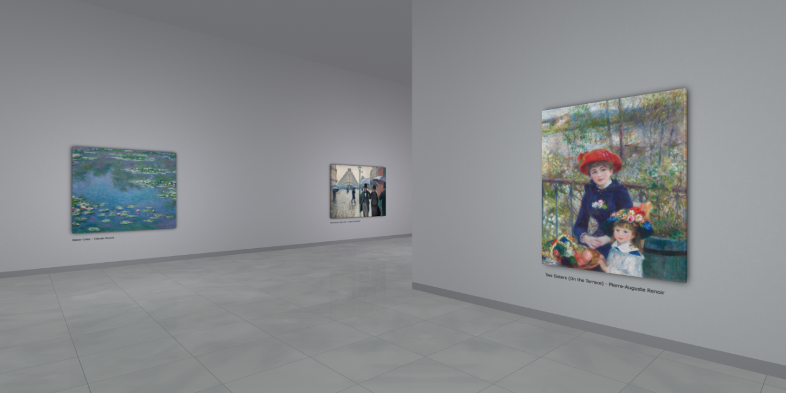

# [Virtual Art Gallery](https://clementcariou.github.io/virtual-art-gallery/build) [](https://github.com/ClementCariou/virtual-art-gallery/actions/workflows/build-and-deploy.yml)

[](https://clementcariou.github.io/virtual-art-gallery/build)

## Description

This project simulates an art gallery in your browser using [REGL](https://github.com/regl-project/regl).
It aims at reproducing the experience of a real art gallery.
The architecture is generated using a 10km long 6th order [Hilbert Curve](https://en.wikipedia.org/wiki/Hilbert_curve).
The paintings are asynchronously loaded from the [ARTIC](https://api.artic.edu) and placed on the walls.
You can use this project to display your own artworks.

## Setup

Installation :
```shell
git clone https://github.com/ClementCariou/virtual-art-gallery.git
npm install
```
Start the budo dev server : 
```shell
npm start
```
Build : 
```shell
npm build
```


